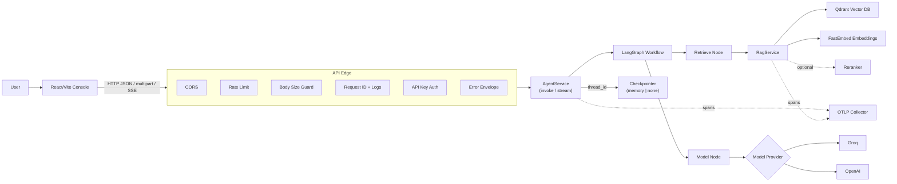
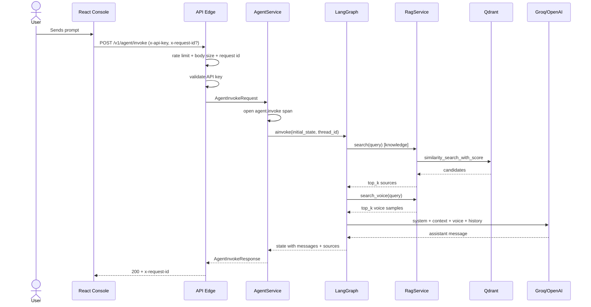
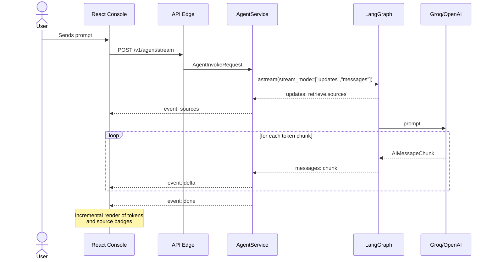
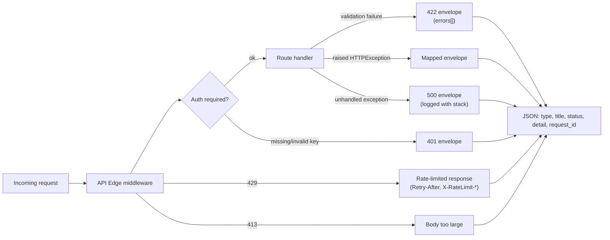
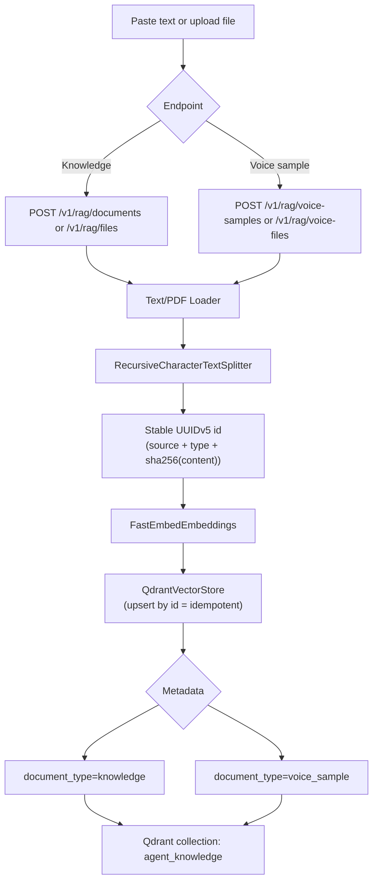
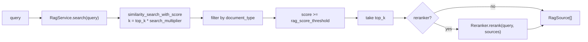
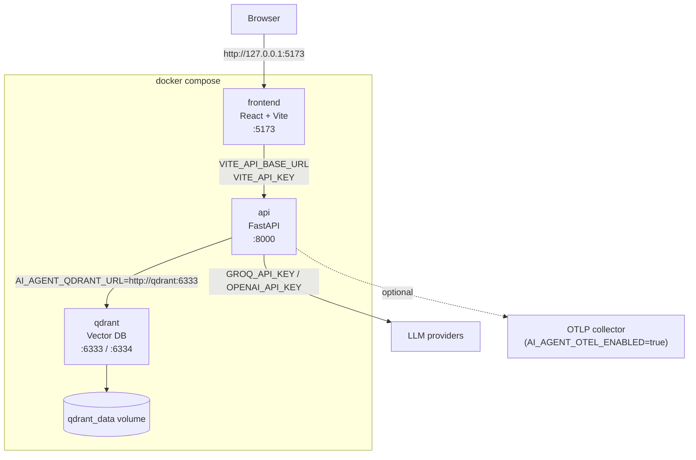
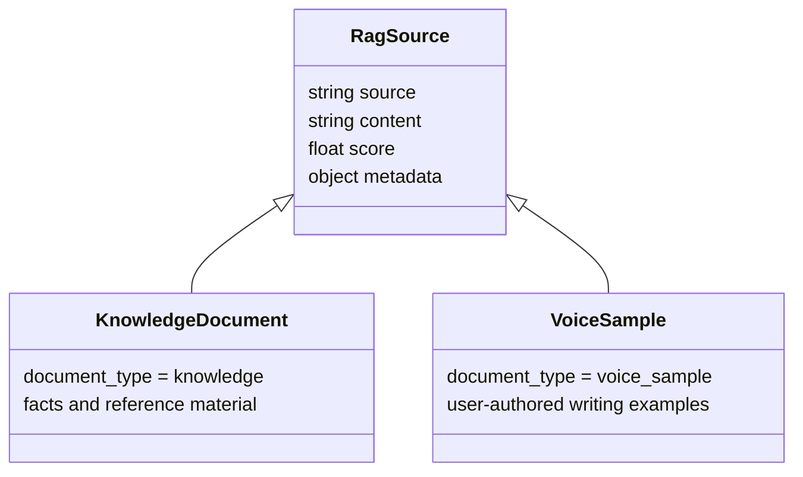
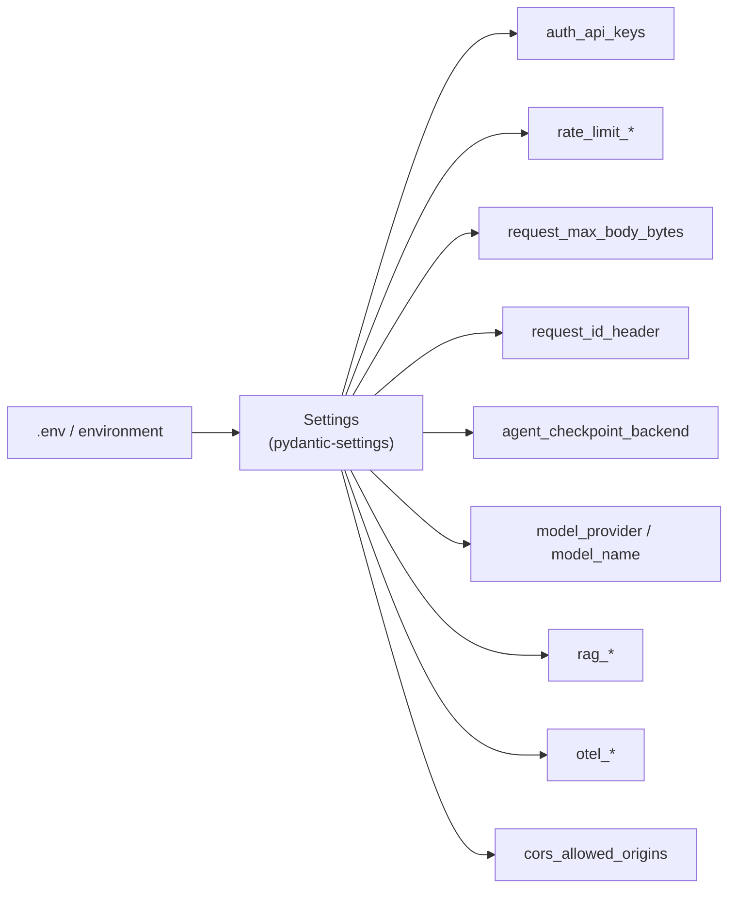

# Architecture Diagrams

## System Overview

## Synchronous Invocation

## Streaming Invocation

## Error Path

## RAG Ingestion

## RAG Retrieval

## Docker Compose Topology

## Source Types

## Configuration Snapshot

